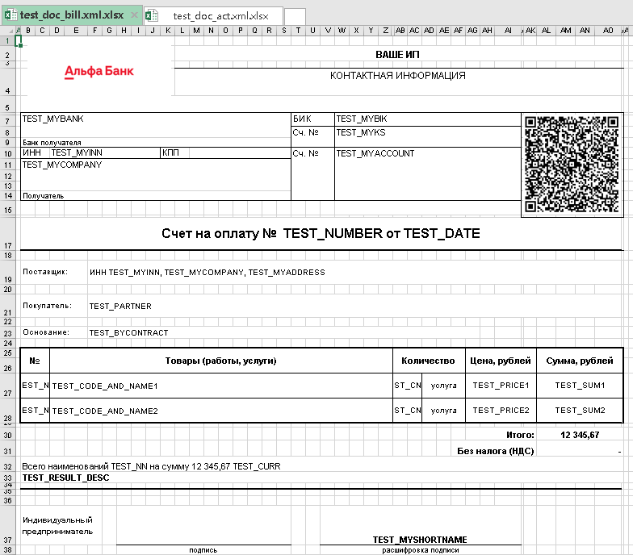
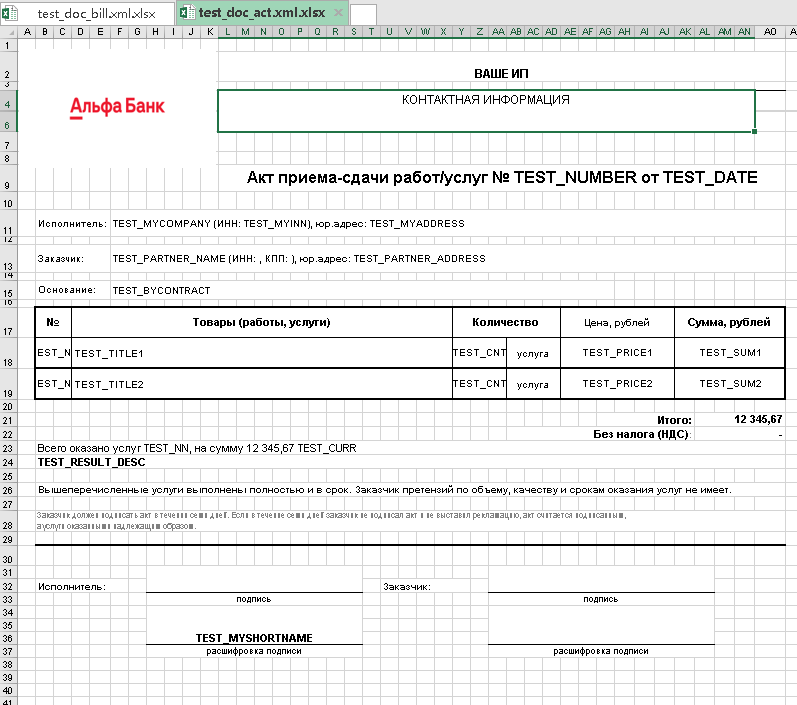

# IPUSN2ExcelTemplates

Плагин для программы ИП УСН2 для печать док-ов в формате XLSX с QR-кодом

Поддерживает документы:
- счет (для юр лиц)
- счет с QRCode (для физ лиц)
- акт

## Информация

**Установка**: 
- Распакуйте во временную папку и запустите: **INSTALL.cmd**

**Ссылки**:
- [Сайт программы](https://ipusn.dynsoft.ru/)     
- [Сайт плагина](https://github.com/dkxce/IPUSN2ExcelTemplates)       
- [Релизы](https://github.com/dkxce/IPUSN2ExcelTemplates/releases)     
- [Архивы](Binaries)     

**Правка шаблонов**:
- До установки: Папка **Templates** архива    
- После установки: Подкаталог программы **<ПУТЬ>\Plugins\ExcelTemplate\Templates**
- После установки: Подкаталог программы **C:\IPUSN2\Plugins\ExcelTemplate\Templates**

**Примеры**:
- [Примеры](Examples)         
    
    